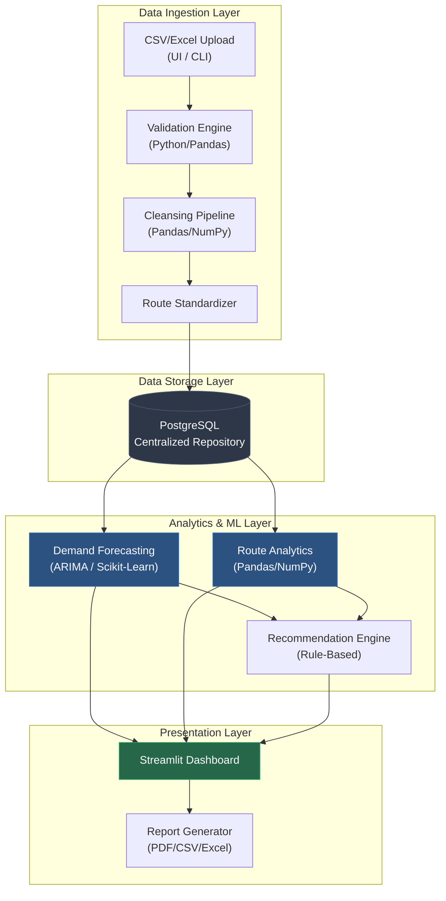
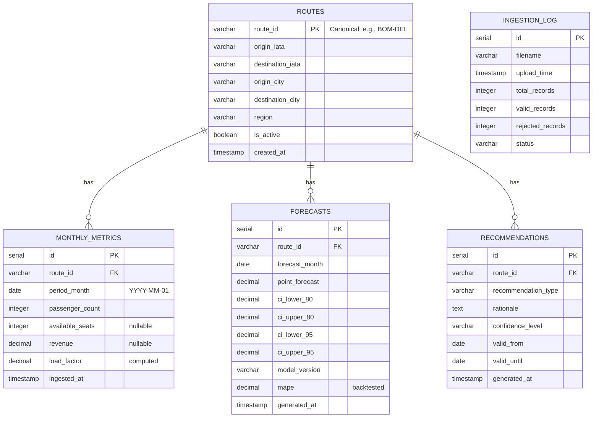
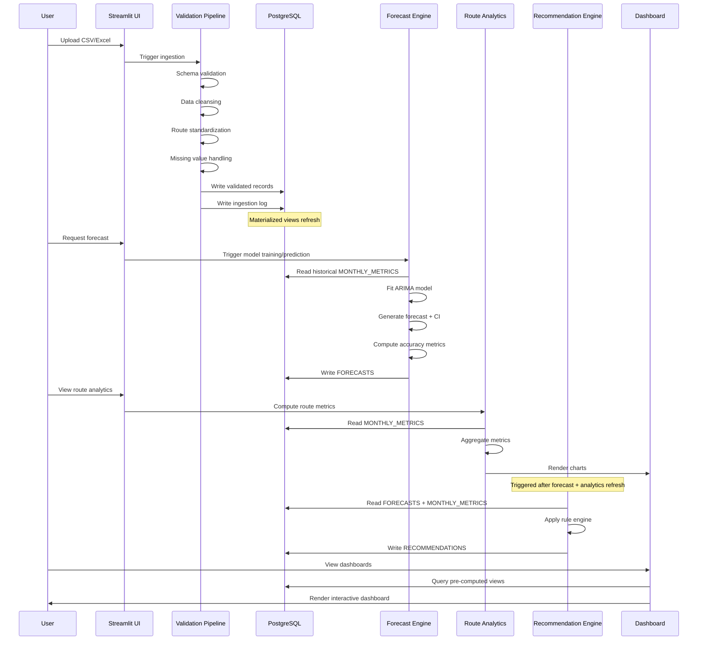

# Product Requirement Document (PRD)

## SkyPredict — Airline Passenger Demand Forecasting & Route Intelligence Platform

| Field | Detail |
|---|---|
| **Document Version** | 1.0 |
| **Status** | Draft — Pending Stakeholder Review |
| **Author** | Principal Product Manager |
| **Date** | 2026-06-11 |
| **Classification** | Internal — Confidential |
| **Stakeholders** | Network Planning, Revenue Management, Business Analytics, Airline Executives, Operations Planning, Engineering |

---

# 1. Executive Summary & Business Case

## 1.1 Product Vision & Value Proposition

> **Vision:** *"To empower airline planners, analysts, and executives with predictive demand intelligence, route performance analytics, and data-driven recommendations that transform airline planning from reactive decision-making to proactive strategic optimization."*

**SkyPredict** is a centralized, web-based analytics platform that consolidates airline operational data, applies machine-learning-driven demand forecasting, and surfaces actionable route intelligence — eliminating the fragmented spreadsheet-and-report workflows that currently govern airline network planning.

### Value Proposition

| Stakeholder | Current Pain | SkyPredict Value |
|---|---|---|
| Network Planning | Manual, backward-looking route analysis; weeks to evaluate expansion candidates | Route-level demand forecasts with confidence intervals; automated growth-opportunity identification |
| Revenue Management | Reactive pricing adjustments based on lagging load-factor reports | Forward-looking demand projections enabling proactive yield optimization and inventory control |
| Business Analytics | Significant manual effort aggregating data across systems for KPI reporting | Unified data repository with pre-built KPI dashboards and exportable executive reports |
| Executives | Strategic decisions anchored to intuition and stale quarterly reports | Real-time executive dashboards with scenario-informed recommendations |
| Operations Planning | Suboptimal aircraft utilization due to delayed demand signals | Capacity-aligned scheduling recommendations driven by forecasted passenger volumes |

**Core thesis:** Every 1-percentage-point improvement in system-wide load factor translates to material revenue uplift. SkyPredict directly targets this lever by replacing reactive planning with predictive intelligence.

---

## 1.2 Strategic Alignment (The "Why Now?")

Three converging forces make this initiative urgent:

1. **Post-pandemic demand volatility.** Traditional seasonality models have degraded. Airlines that rely solely on historical averages are systematically misallocating capacity. Machine-learning models that detect non-linear demand shifts provide a measurable edge.

2. **Competitive pressure on route economics.** Low-cost carrier expansion and dynamic pricing from competitors compress margins. Network planning teams that cannot rapidly identify underperforming routes and pivot capacity are losing market share.

3. **Data maturity inflection point.** The organization now possesses sufficient historical operational data (flight-level passenger counts, load factors, revenue metrics) to support supervised forecasting models. The marginal cost of insight extraction is at its lowest point, while the cost of *not* extracting insight grows with every mis-deployed aircraft.

4. **Academic/Capstone alignment.** The current project timeline and budget constraints create a natural forcing function for a well-scoped Phase 1 MVP, with a clear architectural runway toward enterprise-scale deployment.

---

## 1.3 Target Audience & User Personas

### Persona 1: Priya — Senior Network Planner

| Attribute | Detail |
|---|---|
| **Role** | Network Planning Team Lead |
| **Experience** | 8 years in airline network strategy |
| **Goals** | Identify high-growth routes for frequency expansion; right-size aircraft on underperforming routes; present data-backed proposals to executive committee |
| **Pain Points** | Spends 60% of analysis time in Excel; route-performance data is scattered across 4+ systems; no forward-looking demand signal — only trailing 12-month averages |
| **Success Criteria** | Can generate a route expansion recommendation with supporting forecast data in < 30 minutes (vs. current 2–3 days) |

### Persona 2: Arjun — Revenue Management Analyst

| Attribute | Detail |
|---|---|
| **Role** | Revenue Analyst, Pricing & Inventory |
| **Experience** | 4 years in airline revenue management |
| **Goals** | Anticipate demand surges to adjust pricing tiers; prevent revenue dilution on high-demand routes; monitor booking curves against forecast |
| **Pain Points** | Receives demand data weekly, often after pricing windows have closed; no route-level forecast granularity; limited visibility into seasonal trend shifts |
| **Success Criteria** | Access to monthly route-level demand forecasts updated at minimum weekly cadence; ability to download forecast data for integration with pricing tools |

### Persona 3: Deepa — VP of Airline Strategy

| Attribute | Detail |
|---|---|
| **Role** | Vice President, Strategy & Planning |
| **Experience** | 18 years in aviation |
| **Goals** | Data-driven investment decisions (fleet, route network); board-ready performance summaries; early-warning signals on route deterioration |
| **Pain Points** | Relies on team-generated slide decks that are 2–4 weeks stale; cannot drill into route-level data without requesting ad-hoc analysis; no single source of truth |
| **Success Criteria** | Executive dashboard loads in < 3 seconds; KPIs are current to within 24 hours of last data refresh; can self-serve route drill-downs without analyst support |

### Persona 4: Vikram — Business Analytics Manager

| Attribute | Detail |
|---|---|
| **Role** | Analytics Team Lead |
| **Experience** | 6 years in airline business intelligence |
| **Goals** | Automate recurring demand reports; build forecasting models that the team can iterate on; standardize KPI definitions across departments |
| **Pain Points** | 40% of team bandwidth consumed by data cleansing and reconciliation; models are ad-hoc Jupyter notebooks with no production deployment path; no shared data dictionary |
| **Success Criteria** | Centralized, validated data repository; model outputs accessible via dashboard without manual notebook execution |

---

## 1.4 Success Metrics & KPIs

### North Star Metric

> **Forecast-Influenced Route Decisions per Quarter**
> *The number of route planning, capacity, or frequency decisions that directly reference SkyPredict forecast outputs as a primary input.*

**Rationale:** This metric captures the platform's core value — shifting planning from intuition-based to forecast-informed. It is measurable (decision log integration), attributable, and directly tied to business outcomes.

### Primary KPIs

| KPI | Definition | Target (Phase 1) | Tracking Mechanism |
|---|---|---|---|
| Forecast Accuracy (MAPE) | Mean Absolute Percentage Error of monthly passenger demand forecasts, aggregated across all active routes | ≤ 15% MAPE | Automated backtesting pipeline; comparison of forecast vs. actuals on rolling 3-month basis |
| Platform Adoption Rate | % of target users (Network Planning, Revenue Mgmt, Analytics) actively using the platform weekly | ≥ 60% within 8 weeks of launch | Application login telemetry; session tracking |
| Time-to-Insight | Average time from data availability to actionable insight (forecast + recommendation) for a given route | < 30 minutes (vs. 2–3 day baseline) | User-reported survey; session duration analytics |
| Dashboard Load Time (P95) | 95th-percentile page-load time for primary dashboards | < 3 seconds | Application Performance Monitoring (APM) |

### Guardrail Metrics

| Guardrail | Threshold | Action if Breached |
|---|---|---|
| Data Freshness | Data staleness > 48 hours from last scheduled refresh | Alert to Analytics team; investigate pipeline failure |
| Forecast Drift | MAPE degrades > 5 percentage points from baseline over any rolling 4-week period | Trigger model retraining; notify Analytics team |
| System Error Rate | > 2% of API requests returning 5xx errors | Incident escalation; engineering investigation |
| Data Validation Pass Rate | < 95% of ingested records passing validation rules | Halt pipeline; notify data engineering |

---

# 2. Scope & Core Requirements

## 2.1 High-Level User Journey (Epics & Themes)

| Epic | Theme | Business Objective |
|---|---|---|
| **E1: Data Foundation** | Ingest, validate, cleanse, and standardize airline operational datasets into a centralized repository | Eliminate data silos; establish single source of truth; reduce analyst data-prep time by ≥ 50% |
| **E2: Demand Forecasting** | Build and serve ML-driven monthly passenger demand forecasts at route granularity | Enable proactive capacity and frequency planning; reduce forecast error vs. manual methods |
| **E3: Route Analytics** | Compute and visualize route-level performance metrics (volume, growth, load factor, revenue contribution) | Identify top/bottom performing routes; surface growth opportunities; support network rationalization |
| **E4: Business Recommendations** | Generate rule-based and model-informed recommendations (frequency changes, capacity adjustments, route review) | Accelerate decision-making; codify institutional knowledge; reduce time-to-action |
| **E5: Dashboards & Reporting** | Deliver interactive dashboards (executive, route, forecast) with export capability | Self-serve analytics for all personas; eliminate ad-hoc report requests; ensure data democratization |

---

## 2.2 Functional Requirements

### Epic 1: Data Foundation

| ID | Feature | Description | Priority | Acceptance Criteria | Business Traceability |
|---|---|---|---|---|---|
| FR-101 | Dataset Import | Support CSV/Excel file upload of airline operational datasets (passenger counts, flight schedules, route metadata, revenue data) via UI or CLI | **P0** | User can upload a CSV ≤ 500 MB; system confirms successful ingestion within 60 seconds; upload history is logged | Eliminates manual data aggregation (Persona: Vikram) |
| FR-102 | Data Validation Engine | Validate ingested records against predefined schema rules (mandatory fields, data types, value ranges, referential integrity) | **P0** | ≥ 95% of records in a valid dataset pass validation; invalid records are flagged with specific error codes and written to a rejection log; validation summary is displayed to user | Ensures forecast model input quality; prevents garbage-in-garbage-out |
| FR-103 | Data Cleansing Pipeline | Automated cleansing: duplicate removal, whitespace normalization, date format standardization, categorical encoding consistency | **P0** | Duplicate records are removed (configurable match keys); date fields normalized to ISO 8601; cleansing log captures all transformations applied | Reduces analyst data-prep time (Persona: Vikram) |
| FR-104 | Missing Value Handling | Detect and handle missing values via configurable strategies: drop, mean/median imputation, forward-fill, or interpolation | **P1** | User can select imputation strategy per column; system reports % missing before and after imputation; default strategy is median imputation for numeric, mode for categorical | Data completeness for model training |
| FR-105 | Route Standardization | Normalize route identifiers (e.g., "DEL-BOM" vs. "BOM-DEL" treated as same route; IATA code validation) | **P0** | All route pairs are normalized to canonical form (alphabetically ordered IATA codes); invalid IATA codes are flagged; standardized route ID is the join key across all modules | Prevents route fragmentation in analytics |
| FR-106 | Data Dictionary & Metadata Registry | Maintain a browsable data dictionary documenting all fields, types, business definitions, and lineage | **P1** | Data dictionary is auto-generated on ingestion; users can add business descriptions; dictionary is accessible from the UI | Standardize KPI definitions across departments (Persona: Vikram) |

---

### Epic 2: Demand Forecasting

| ID | Feature | Description | Priority | Acceptance Criteria | Business Traceability |
|---|---|---|---|---|---|
| FR-201 | Monthly Demand Forecast | Generate monthly passenger demand forecasts for each active route using time-series ML models (ARIMA baseline; extensible to Prophet, XGBoost, LSTM) | **P0** | Forecast generated for each route with ≥ 24 months of historical data; output includes point forecast + 80% and 95% confidence intervals; MAPE ≤ 15% on backtesting holdout | Core value: proactive planning (Persona: Priya, Arjun) |
| FR-202 | Route-Level Forecast Granularity | Forecasts are produced and queryable at individual route level (origin-destination pair) | **P0** | User can select any active route and view its forecast; routes with insufficient data display "Insufficient History" status with minimum data threshold explanation | Route-specific decisions require route-specific forecasts |
| FR-203 | Seasonal Trend Decomposition | Decompose demand signal into trend, seasonal, and residual components; display decomposition visually | **P1** | Decomposition chart renders for any selected route; user can toggle between additive and multiplicative decomposition; seasonality period is configurable (default: 12 months) | Enables Revenue Mgmt to anticipate seasonal pricing adjustments (Persona: Arjun) |
| FR-204 | Forecast Confidence Intervals | Display prediction uncertainty bands (80%, 95%) alongside point forecasts | **P0** | Confidence intervals are visible on all forecast charts; interval width reflects model uncertainty; intervals widen appropriately for longer forecast horizons | Decision-makers need to understand forecast reliability (Persona: Deepa) |
| FR-205 | Future Demand Projection | Project demand 3, 6, and 12 months into the future with selectable horizon | **P1** | User can select forecast horizon; projections update in < 5 seconds; forecasts beyond available history are clearly marked as projections | Long-range capacity and fleet planning (Persona: Priya) |
| FR-206 | Model Performance Dashboard | Display model accuracy metrics (MAPE, RMSE, MAE) per route and system-wide; support backtesting visualization | **P1** | Accuracy metrics are computed on holdout set; metrics are refreshed on each model retraining; worst-performing routes are highlighted for review | Forecast trust and continuous improvement (Persona: Vikram) |
| FR-207 | Forecast Data Export | Export forecast results (point forecast, confidence intervals, actuals) as CSV or Excel | **P1** | Export includes route, date, forecast, lower/upper CI, actual (where available); file downloads in < 10 seconds for full route set | Integration with downstream pricing tools (Persona: Arjun) |

---

### Epic 3: Route Analytics

| ID | Feature | Description | Priority | Acceptance Criteria | Business Traceability |
|---|---|---|---|---|---|
| FR-301 | Passenger Volume Analysis | Aggregate and visualize total passenger counts by route, region, and time period | **P0** | User can filter by route, origin/destination city, region, and date range; chart updates in < 3 seconds; supports bar, line, and heatmap views | Route performance visibility (Persona: Priya) |
| FR-302 | Route Performance Ranking | Rank routes by configurable metrics: total passengers, growth rate, load factor, revenue contribution | **P0** | User can select ranking metric and sort order; top-N and bottom-N filtering; ranking table is exportable; tied routes are ordered alphabetically | Identify best/worst performing routes (Persona: Priya, Deepa) |
| FR-303 | Growth Rate Analysis | Calculate and visualize YoY and MoM passenger growth rates per route | **P1** | Growth rates computed for routes with ≥ 13 months of data; negative growth routes are visually flagged (red); growth trend sparklines are displayed in ranking table | Identify emerging and declining routes (Persona: Priya) |
| FR-304 | Load Factor Analysis | Compute and display load factor (passengers / available seats) by route and time period | **P0** | Load factor computed where seat capacity data is available; routes with LF < 60% are flagged as "Underperforming"; routes with LF > 90% are flagged as "Capacity Constrained" | Capacity optimization (Persona: Priya, Operations) |
| FR-305 | Revenue Contribution Analysis | Calculate each route's percentage contribution to total network revenue; visualize as Pareto chart | **P1** | Revenue contribution computed where revenue data is available; Pareto chart identifies routes contributing to top 80% of revenue; data is exportable | Revenue concentration risk; route prioritization (Persona: Deepa) |
| FR-306 | Route Comparison | Side-by-side comparison of up to 4 routes across all performance metrics | **P2** | User can select 2–4 routes; comparison renders as multi-metric table and overlay charts; metrics include volume, growth, LF, revenue, forecast | Competitive route evaluation (Persona: Priya) |

---

### Epic 4: Business Recommendations

| ID | Feature | Description | Priority | Acceptance Criteria | Business Traceability |
|---|---|---|---|---|---|
| FR-401 | Recommendation Engine | Generate actionable recommendations per route based on forecast and analytics outputs using a configurable rule engine | **P0** | Recommendations are generated for all active routes; each recommendation includes: type, rationale, supporting data points, and confidence level; recommendations refresh on new data/forecast | Accelerate decision-making (Persona: Priya, Deepa) |
| FR-402 | Recommendation Types | Support the following recommendation categories: Increase Frequency, Reduce Capacity, Upgrade Aircraft, Review Route Profitability, Expand Route, Monitor (No Action) | **P0** | Each route receives exactly one primary recommendation; recommendation type is derived from configurable threshold rules (e.g., LF > 85% + positive growth → "Increase Frequency") | Codify institutional planning heuristics |
| FR-403 | Recommendation Rationale | Each recommendation includes a natural-language rationale explaining the data-driven basis | **P1** | Rationale references specific metrics (e.g., "Load factor has exceeded 88% for 3 consecutive months with 12% YoY growth"); rationale is displayed alongside the recommendation card | Decision transparency and auditability (Persona: Deepa) |
| FR-404 | Recommendation Filtering & Prioritization | Filter recommendations by type, route, region, priority level; sort by estimated impact | **P1** | User can apply multiple filters simultaneously; results update in < 2 seconds; export filtered recommendations as PDF or CSV | Workflow efficiency (Persona: Priya) |
| FR-405 | Advisory Disclaimer | All recommendations include a visible disclaimer that outputs are advisory and require human validation before operational action | **P0** | Disclaimer is persistent on all recommendation views; disclaimer text is configurable by admin; disclaimer cannot be hidden or dismissed permanently | Regulatory and operational risk mitigation |

---

### Epic 5: Dashboards & Reporting

| ID | Feature | Description | Priority | Acceptance Criteria | Business Traceability |
|---|---|---|---|---|---|
| FR-501 | Executive Dashboard | High-level KPI summary: total passengers, system LF, revenue, top routes, forecast accuracy, network health indicators | **P0** | Dashboard loads in < 3 seconds; displays current-period KPIs with period-over-period delta; supports date range selection; auto-refreshes on data pipeline completion | Self-serve executive visibility (Persona: Deepa) |
| FR-502 | Route Performance Dashboard | Detailed route-level analytics view with drill-down capability | **P0** | User can navigate from network overview → region → individual route; all charts are interactive (hover tooltips, click-to-filter); supports full-screen mode | Route-level decision support (Persona: Priya) |
| FR-503 | Forecast Dashboard | Dedicated view for forecast outputs: forecast chart, decomposition, model metrics, confidence intervals | **P0** | Forecast chart renders for any selected route; toggle between 3/6/12-month horizons; overlay actuals vs. forecast; display model accuracy metrics | Forecast consumption and trust-building (Persona: Arjun) |
| FR-504 | KPI Monitoring Panel | Configurable KPI cards with threshold-based color coding (green/amber/red) | **P1** | User can configure KPI thresholds; color coding updates in real-time; KPI definitions are linked to data dictionary | Operational alerting (All Personas) |
| FR-505 | Report Generation & Export | Generate downloadable reports (PDF, CSV, Excel) for any dashboard view or data subset | **P1** | Export completes in < 15 seconds for datasets up to 100K rows; PDF reports include charts and tables; exported files include generation timestamp and filter context | Offline sharing, board presentations (Persona: Deepa) |
| FR-506 | Dashboard Personalization | Users can save dashboard filter configurations as named views | **P2** | Users can create, rename, and delete saved views; views persist across sessions; up to 10 saved views per user | Workflow efficiency for repeat analysis |

---

## 2.3 Out of Scope (Phase 1)

The following capabilities are explicitly excluded from Phase 1 to prevent scope creep and protect timeline integrity. They are documented here as candidates for future phases.

| Item | Rationale for Exclusion |
|---|---|
| **Real-time streaming data ingestion** | Phase 1 operates on batch-processed historical data. Real-time integration requires event-streaming infrastructure (Kafka/Kinesis) not justified for MVP. |
| **Scenario Planning & Simulation** | Acknowledged as a future enhancement. Requires a separate simulation engine and significant UX investment. Deferred to Phase 2. |
| **Multi-airline / Competitive intelligence** | Phase 1 is single-airline. Cross-carrier data introduces regulatory (antitrust), data sourcing, and schema complexity. |
| **Automated pricing/inventory actions** | Recommendations are advisory only. Closed-loop automation into Revenue Management Systems (RMS) requires extensive integration and change management. |
| **Natural Language Querying (NLQ)** | "Ask a question in plain English" interfaces require LLM integration and prompt-engineering investment beyond Phase 1 scope. |
| **Mobile application** | Dashboard is web-responsive but a dedicated native mobile app is not in scope. |
| **User management & RBAC (full enterprise)** | Phase 1 supports basic authentication. Full RBAC with role-based dashboard permissions is deferred. |
| **External data enrichment** | Integration with external data sources (weather, fuel prices, economic indicators, competitor schedules) is a Phase 2 enhancement. |

---

# 3. Technical Architecture & Integration Touchpoints

## 3.1 System Architecture Overview

## 3.2 System Constraints & Assumptions

### Constraints

| ID | Constraint | Implication |
|---|---|---|
| TC-01 | Initial deployment supports **100+ routes** | Database schema and query patterns must handle at minimum 100 routes × 36 months × 12 metrics = ~43,200 time-series records efficiently. Indexing strategy on `(route_id, date)` is mandatory. |
| TC-02 | Forecast generation must complete within **acceptable processing time** (target: < 5 minutes for full route set) | ARIMA model fitting for 100+ routes serially may exceed target. Mitigation: parallelize via `joblib` or `multiprocessing`; cache trained models; retrain only on new data. |
| TC-03 | Dashboard response time **< 3 seconds** (P95) | Pre-compute aggregations in PostgreSQL materialized views; implement Streamlit caching (`@st.cache_data`); minimize real-time computation on page load. |
| TC-04 | **Budget constraints** for cloud infrastructure | Architecture must support local deployment (single-server or Docker Compose). Cloud deployment is optional and should leverage free-tier or minimal-cost configurations. |
| TC-05 | **Academic/capstone timeline** | Architecture decisions favor simplicity and proven libraries over cutting-edge but complex alternatives. Streamlit over React+FastAPI for Phase 1. |

### Assumptions

| ID | Assumption | Risk if Invalid |
|---|---|---|
| A-01 | Historical airline operational data is available for ≥ 24 months at route-month granularity | Insufficient history degrades ARIMA forecast quality. Mitigation: fallback to simpler moving-average models for routes with < 24 months data. |
| A-02 | Data includes passenger counts, available seats (for LF), and revenue per route-month | Missing seat or revenue data disables FR-304 (Load Factor) and FR-305 (Revenue Contribution). Graceful degradation: features display "Data Not Available." |
| A-03 | Route identifiers use standard IATA airport codes | Non-standard codes require a mapping table. FR-105 should include a code-resolution fallback. |
| A-04 | Single-user or low-concurrency access pattern in Phase 1 | Streamlit's default single-threaded model is sufficient. If concurrency exceeds 5 simultaneous users, consider deploying behind a load balancer or migrating to FastAPI. |
| A-05 | Python 3.9+ is the runtime environment | All library compatibility is validated against Python 3.9+. |

---

## 3.3 Data Architecture & Flow

### Data Model (Core Entities)

### Data Flow — End-to-End Pipeline

### Data Pipeline Stages

| Stage | Input | Processing | Output | Storage |
|---|---|---|---|---|
| **1. Ingestion** | CSV/Excel file | Parse, validate schema, log metadata | Raw validated records | `monthly_metrics`, `ingestion_log` |
| **2. Cleansing** | Raw records | Dedup, normalize, standardize routes, impute missing | Clean records | `monthly_metrics` (upsert) |
| **3. Aggregation** | Clean records | Compute materialized views: route summaries, regional aggregates, KPIs | Pre-computed aggregates | PostgreSQL materialized views |
| **4. Forecasting** | Historical monthly_metrics per route | ARIMA model fit → predict → confidence intervals → backtesting | Forecast records | `forecasts` |
| **5. Analytics** | monthly_metrics + forecasts | Growth rates, rankings, LF computation, revenue contribution | Derived metrics | Served from materialized views + in-memory Pandas |
| **6. Recommendations** | Forecasts + analytics metrics | Rule engine evaluation per route | Recommendation records | `recommendations` |
| **7. Presentation** | All of the above | Streamlit dashboard rendering, chart generation, report export | Interactive UI + downloadable reports | In-memory (Streamlit session state) |

---

## 3.4 Critical Third-Party Integrations & Dependencies

| Dependency | Type | Version Constraint | Risk Level | Notes |
|---|---|---|---|---|
| **Python** | Runtime | ≥ 3.9 | Low | Widely available; well-supported |
| **Pandas** | Library | ≥ 1.5 | Low | Core data manipulation; stable API |
| **NumPy** | Library | ≥ 1.23 | Low | Numerical computation backbone |
| **Scikit-Learn** | Library | ≥ 1.2 | Low | ML utilities, preprocessing, metrics |
| **Statsmodels** | Library | ≥ 0.13 | Medium | ARIMA implementation; API changes between minor versions — pin version |
| **Streamlit** | Framework | ≥ 1.28 | Medium | Dashboard framework; rapid iteration advantage but limited customization; may require migration to React+FastAPI for enterprise scale |
| **Plotly** | Library | ≥ 5.15 | Low | Interactive charting; Streamlit-native integration |
| **Matplotlib** | Library | ≥ 3.7 | Low | Static charts; report generation |
| **PostgreSQL** | Database | ≥ 14 | Low | Mature RDBMS; handles Phase 1 data volumes comfortably |
| **psycopg2 / SQLAlchemy** | Library | Latest stable | Low | PostgreSQL Python drivers |
| **openpyxl / xlsxwriter** | Library | Latest stable | Low | Excel import/export |
| **ReportLab / WeasyPrint** | Library | Latest stable | Medium | PDF report generation; WeasyPrint has system-level dependencies (Cairo, Pango) |

> [!IMPORTANT]
> **No external API dependencies in Phase 1.** All data is file-uploaded. This eliminates runtime dependency on third-party API availability but limits data freshness to manual upload cadence.

---

# 4. Non-Functional Requirements (NFRs)

## 4.1 Performance

| NFR ID | Requirement | Target | Measurement Method |
|---|---|---|---|
| NFR-P01 | Dashboard page load time (P95) | < 3 seconds | Application-level timing instrumentation; Streamlit profiler |
| NFR-P02 | Forecast generation time (full route set, 100+ routes) | < 5 minutes | Pipeline execution timer; logged per run |
| NFR-P03 | Data ingestion throughput | Process 500 MB CSV in < 60 seconds | Ingestion pipeline timer |
| NFR-P04 | Database query response time (pre-computed views) | < 500 ms (P95) | PostgreSQL `pg_stat_statements` monitoring |
| NFR-P05 | Report export time (PDF, up to 100K rows) | < 15 seconds | Export function timer |
| NFR-P06 | Concurrent user support | ≥ 5 simultaneous users without degradation | Load testing (Locust or k6) |
| NFR-P07 | Scalability path | Architecture supports migration to FastAPI + React for 50+ concurrent users | Architectural review; documented migration guide |

## 4.2 Security, Compliance, and Data Privacy

| NFR ID | Requirement | Implementation |
|---|---|---|
| NFR-S01 | **Authentication** | Basic username/password authentication for Phase 1; Streamlit Authenticator library or equivalent |
| NFR-S02 | **Transport encryption** | HTTPS (TLS 1.2+) enforced for all client-server communication in any deployment beyond localhost |
| NFR-S03 | **Data at rest** | PostgreSQL Transparent Data Encryption (TDE) or volume-level encryption if cloud-deployed |
| NFR-S04 | **No PII in datasets** | System does not ingest or store Personally Identifiable Information. Validation pipeline should flag and reject any fields matching PII patterns (email, phone, name columns) |
| NFR-S05 | **Audit logging** | All data ingestion events, model training runs, and report exports are logged with user ID, timestamp, and action type |
| NFR-S06 | **SQL injection prevention** | All database queries use parameterized queries via SQLAlchemy ORM; no raw string interpolation |
| NFR-S07 | **Dependency vulnerability scanning** | `pip-audit` or `safety` integrated into CI pipeline; no known critical CVEs in production dependencies |
| NFR-S08 | **Access control (Phase 2 readiness)** | Data model includes `user_role` field; dashboard views are architecturally separable by role for future RBAC implementation |

## 4.3 Reliability & Availability

| NFR ID | Requirement | Target | Implementation |
|---|---|---|---|
| NFR-R01 | **Availability SLA** | 99% uptime during business hours (8:00–20:00 local time, weekdays) | Single-server deployment with process monitoring (systemd/supervisord or Docker restart policy) |
| NFR-R02 | **Data durability** | Zero data loss for ingested and validated records | PostgreSQL WAL-based backup; daily automated `pg_dump` |
| NFR-R03 | **Error handling — Ingestion** | Partial ingestion failure must not corrupt existing data | Transactional ingestion: entire file succeeds or rolls back; rejection log captures failed records |
| NFR-R04 | **Error handling — Forecasting** | Model failure for one route must not block forecasting for other routes | Per-route try/catch with error logging; failed routes are flagged in model performance dashboard |
| NFR-R05 | **Error handling — UI** | Application errors display user-friendly messages, not stack traces | Streamlit error boundaries; global exception handler |
| NFR-R06 | **Backup & Recovery** | Database recoverable to within 24 hours of failure | Daily `pg_dump` to local or cloud storage; documented restore procedure |
| NFR-R07 | **Graceful degradation** | If forecasting module fails, route analytics and dashboards remain functional | Modules are loosely coupled; dashboard reads from database, not directly from forecast process |

---

# 5. Risks, Dependencies, and Mitigations

## 5.1 Technical & Operational Risks

| Risk ID | Risk | Probability | Impact | Description |
|---|---|---|---|---|
| R-01 | **Insufficient historical data** | Medium | High | Routes with < 24 months of data will produce unreliable ARIMA forecasts. Some routes may have no history at all. |
| R-02 | **Data quality issues** | High | High | Airline operational data is frequently messy: missing months, inconsistent route codes, duplicate records, unit mismatches (PAX vs. revenue passenger-km). |
| R-03 | **ARIMA model limitations** | Medium | Medium | ARIMA assumes stationarity and struggles with structural breaks (e.g., pandemic, new competitor entry). Forecast accuracy may degrade for routes with non-stationary demand. |
| R-04 | **Streamlit scalability ceiling** | Low (Phase 1) | Medium | Streamlit is single-threaded. Beyond ~10 concurrent users, performance degrades significantly. Acceptable for Phase 1 but a hard blocker for enterprise rollout. |
| R-05 | **External event impact on demand** | High | Medium | Weather, fuel prices, regulatory changes, and geopolitical events affect demand in ways that internal-data-only models cannot capture. Forecast accuracy is inherently bounded. |
| R-06 | **Model drift over time** | Medium | Medium | As demand patterns evolve, model accuracy will degrade without periodic retraining. No automated retraining is in Phase 1 scope. |
| R-07 | **Dependency on open-source library stability** | Low | Medium | Statsmodels ARIMA API has changed between versions. A breaking change in a dependency update could disrupt forecasting. |

## 5.2 Timeline Dependencies (Blockers)

| Dependency ID | Dependency | Owner | Blocker For | Status |
|---|---|---|---|---|
| D-01 | **Availability of cleaned, structured airline dataset** | Data / Analytics Team | All Epics (E1–E5) | 🔴 Critical — No dataset, no platform. Must be secured before development begins. |
| D-02 | **PostgreSQL instance provisioned** | Engineering / DevOps | E1 (Data Foundation) | 🟡 Medium — Can develop against SQLite locally, but production schema must target PostgreSQL. |
| D-03 | **IATA airport code reference table** | Data Engineering | FR-105 (Route Standardization) | 🟡 Medium — Publicly available; needs to be ingested and maintained. |
| D-04 | **Stakeholder alignment on KPI definitions** | Product + Business Analytics | FR-504 (KPI Monitoring), FR-501 (Executive Dashboard) | 🟡 Medium — Ambiguity in LF calculation (revenue vs. total passengers) or revenue definition (gross vs. net) will cause downstream confusion. |
| D-05 | **Recommendation rule thresholds** | Product + Network Planning | FR-401, FR-402 (Recommendation Engine) | 🟡 Medium — Rules (e.g., "LF > 85% → Increase Frequency") require domain expert validation. |
| D-06 | **Cloud environment (if applicable)** | DevOps | Deployment | 🟢 Low — Phase 1 can run locally. Cloud deployment is stretch goal. |

## 5.3 Mitigation Strategies

| Risk / Dep ID | Mitigation Strategy | Owner | Timeline |
|---|---|---|---|
| R-01 | Implement tiered model selection: routes with ≥ 24 months → ARIMA; routes with 12–23 months → Exponential Smoothing; routes with < 12 months → Simple Moving Average with "Low Confidence" flag | Engineering | Sprint 2–3 |
| R-02 | Build robust validation pipeline (FR-102) with strict schema enforcement; create a data quality scorecard per ingestion run; establish a data quality SLA with data providers | Engineering + Data | Sprint 1 |
| R-03 | Architecture supports pluggable model interface: ARIMA is the Phase 1 baseline, but the model layer accepts any `fit()`/`predict()` compatible model. Phase 2 can introduce Prophet, XGBoost, or ensemble methods without architectural changes. | Engineering | Sprint 2 (architecture), Phase 2 (advanced models) |
| R-04 | Document Streamlit-to-FastAPI+React migration path. Ensure all business logic is in service-layer Python modules, not embedded in Streamlit UI code. This enables frontend swap without rewriting business logic. | Engineering (Arch) | Sprint 1 (architecture decision), Phase 2 (migration) |
| R-05 | Display advisory disclaimer (FR-405) on all forecasts and recommendations. Include "Forecast assumes no exogenous shocks" caveat. Phase 2: integrate external data sources as model features. | Product + Engineering | Sprint 3 (disclaimer), Phase 2 (external data) |
| R-06 | Implement manual retraining trigger (UI button) in Phase 1. Phase 2: automated retraining on new data ingestion with drift-detection alerts (guardrail metric: MAPE degradation > 5pp). | Engineering | Sprint 3 (manual), Phase 2 (automated) |
| R-07 | Pin all dependency versions in `requirements.txt`. Use `pip-compile` (pip-tools) for deterministic dependency resolution. Run `pip-audit` in CI. | Engineering | Sprint 1 |
| D-01 | Identify and validate dataset source immediately. Options: (a) airline partner data, (b) publicly available aviation datasets (e.g., US DOT T-100, OpenFlights), (c) synthetic dataset generation. Decision required by **Sprint 0 completion**. | Product + Data | Pre-Sprint 1 |
| D-04 | Conduct a 2-hour KPI definition workshop with Network Planning, Revenue Mgmt, and Analytics stakeholders. Document agreed definitions in the data dictionary (FR-106). | Product | Sprint 1 |
| D-05 | Schedule a 1-hour rule calibration session with Senior Network Planners. Document initial thresholds; make thresholds configurable in the platform (not hardcoded). | Product + Engineering | Sprint 2 |

---

# Appendix A: Glossary

| Term | Definition |
|---|---|
| **IATA Code** | Three-letter airport code assigned by the International Air Transport Association (e.g., DEL = Delhi, BOM = Mumbai) |
| **Load Factor (LF)** | Passenger count ÷ available seats × 100. Measures capacity utilization. |
| **MAPE** | Mean Absolute Percentage Error. Primary forecast accuracy metric. Lower is better. |
| **ARIMA** | AutoRegressive Integrated Moving Average. A statistical time-series forecasting model. |
| **PAX** | Industry abbreviation for "passengers" |
| **Materialized View** | A database object that stores the result of a query physically, enabling faster reads at the cost of periodic refresh. |
| **RBAC** | Role-Based Access Control. Access permissions assigned to roles rather than individual users. |
| **CI (in forecasting)** | Confidence Interval. A range indicating the uncertainty around a point forecast. |
| **WAL** | Write-Ahead Logging. A PostgreSQL durability mechanism that logs changes before applying them. |

---

# Appendix B: Phase Roadmap (Indicative)

| Phase | Scope | Timeline (Indicative) |
|---|---|---|
| **Phase 1 (MVP)** | Data Foundation + Demand Forecasting (ARIMA) + Route Analytics + Rule-Based Recommendations + Streamlit Dashboards | 8–12 weeks |
| **Phase 2** | Advanced ML models (Prophet, XGBoost) + Scenario Planning + External Data Integration + RBAC + FastAPI migration | 12–16 weeks post Phase 1 |
| **Phase 3** | Real-time data streaming + NLQ interface + Mobile app + Automated actions + Multi-airline support | 16–24 weeks post Phase 2 |

---

> [!NOTE]
> This document is a living artifact. It will be updated as stakeholder feedback is incorporated, technical spikes are completed, and scope is refined through sprint planning.

---

**Document Control**

| Version | Date | Author | Changes |
|---|---|---|---|
| 1.0 | 2026-06-11 | Principal Product Manager | Initial PRD creation |
