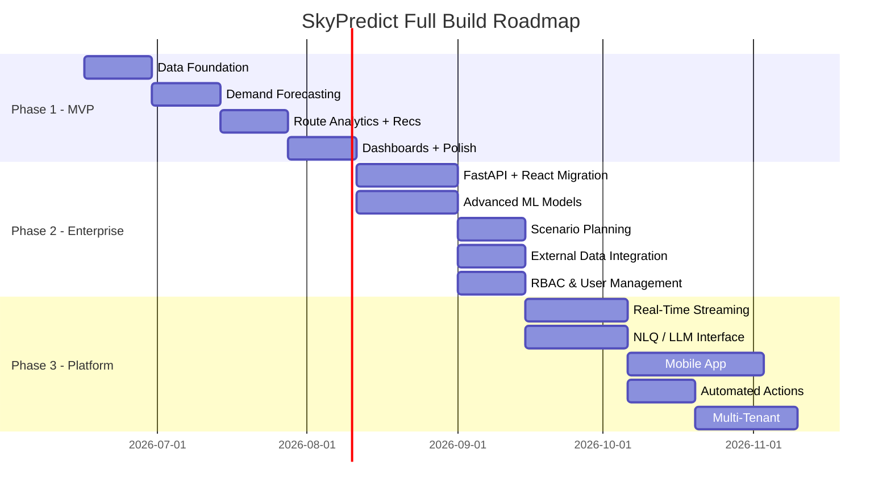

# SkyPredict — Full Build Time Estimate (All 3 Phases)

> [!NOTE]
> This estimate covers the **entire product roadmap** from the PRD — Phase 1 (MVP), Phase 2 (Enterprise), and Phase 3 (Platform). It assumes AI-assisted development (fast code generation, but human review/testing/debugging cycles still apply).

---

## Grand Total Summary

| Phase | Scope | Effort (Hours) | Calendar (Full-Time) | Calendar (Part-Time 20h/wk) | PRD Estimate |
|---|---|---|---|---|---|
| **Phase 1 — MVP** | Data + ARIMA + Analytics + Recs + Streamlit | **120–160h** | 3–4 weeks | 6–8 weeks | 8–12 weeks |
| **Phase 2 — Enterprise** | Advanced ML + Scenario + External Data + RBAC + FastAPI/React | **220–300h** | 6–8 weeks | 11–15 weeks | 12–16 weeks |
| **Phase 3 — Platform** | Real-time + NLQ + Mobile + Automation + Multi-airline | **320–440h** | 8–11 weeks | 16–22 weeks | 16–24 weeks |
| **GRAND TOTAL** | Full Product | **660–900h** | **17–23 weeks** | **33–45 weeks** | **36–52 weeks** |

> [!IMPORTANT]
> Phase 2 and Phase 3 are **significantly more complex** than Phase 1. Phase 1 is a focused Python/Streamlit app. Phase 2 is a full **architecture migration** (Streamlit → FastAPI + React). Phase 3 introduces **real-time infrastructure, LLM integration, and mobile development** — each of which is a project in itself.

---

# Phase 1 — MVP (120–160 hours)

### Epic 1: Data Foundation — ~22–28h

| ID | Feature | Priority | Hours | Notes |
|---|---|---|---|---|
| FR-101 | Dataset Import (CSV/Excel) | P0 | 3–4h | Streamlit uploader + Pandas |
| FR-102 | Data Validation Engine | P0 | 4–5h | Schema rules, error codes, rejection log |
| FR-103 | Data Cleansing Pipeline | P0 | 4–5h | Dedup, normalization, date standardization |
| FR-104 | Missing Value Handling | P1 | 3–4h | Configurable imputation per column |
| FR-105 | Route Standardization | P0 | 3–4h | IATA validation, canonical route pairs |
| FR-106 | Data Dictionary & Metadata Registry | P1 | 3–4h | Auto-generated + UI browsable |
| — | DB Schema + Migrations | — | 2–3h | PostgreSQL tables, indexes, materialized views |

### Epic 2: Demand Forecasting — ~28–35h

| ID | Feature | Priority | Hours | Notes |
|---|---|---|---|---|
| FR-201 | Monthly Demand Forecast (ARIMA) | P0 | 8–10h | **Highest-risk item.** Tuning, stationarity, backtesting |
| FR-202 | Route-Level Granularity | P0 | 2–3h | Per-route loop + edge case handling |
| FR-203 | Seasonal Trend Decomposition | P1 | 3–4h | statsmodels decompose + Plotly |
| FR-204 | Forecast Confidence Intervals | P0 | 2–3h | 80%/95% CI visualization |
| FR-205 | Future Demand Projection | P1 | 2–3h | 3/6/12-month selectable horizon |
| FR-206 | Model Performance Dashboard | P1 | 4–5h | MAPE/RMSE/MAE + backtesting viz |
| FR-207 | Forecast Data Export | P1 | 2–3h | CSV/Excel with all fields |
| — | Pluggable model interface | — | 3–4h | Abstract `fit()`/`predict()` for future models |

### Epic 3: Route Analytics — ~18–24h

| ID | Feature | Priority | Hours | Notes |
|---|---|---|---|---|
| FR-301 | Passenger Volume Analysis | P0 | 3–4h | Multi-filter + bar/line/heatmap |
| FR-302 | Route Performance Ranking | P0 | 3–4h | Configurable ranking + export |
| FR-303 | Growth Rate Analysis | P1 | 3–4h | YoY/MoM + sparklines |
| FR-304 | Load Factor Analysis | P0 | 3–4h | LF computation + threshold flags |
| FR-305 | Revenue Contribution Analysis | P1 | 3–4h | Pareto chart |
| FR-306 | Route Comparison | P2 | 3–4h | Side-by-side (up to 4 routes) |

### Epic 4: Business Recommendations — ~14–18h

| ID | Feature | Priority | Hours | Notes |
|---|---|---|---|---|
| FR-401 | Recommendation Engine | P0 | 4–5h | Configurable rule engine |
| FR-402 | Recommendation Types (6 categories) | P0 | 3–4h | Rule mapping logic |
| FR-403 | Recommendation Rationale | P1 | 2–3h | NL rationale from metrics |
| FR-404 | Filtering & Prioritization | P1 | 3–4h | Multi-filter + sort + export |
| FR-405 | Advisory Disclaimer | P0 | 1–2h | Persistent disclaimer |

### Epic 5: Dashboards & Reporting — ~22–30h

| ID | Feature | Priority | Hours | Notes |
|---|---|---|---|---|
| FR-501 | Executive Dashboard | P0 | 5–6h | KPI summary + deltas |
| FR-502 | Route Performance Dashboard | P0 | 5–6h | Network → region → route drill-down |
| FR-503 | Forecast Dashboard | P0 | 4–5h | Forecast + decomposition + CI overlay |
| FR-504 | KPI Monitoring Panel | P1 | 3–4h | Threshold-based color coding |
| FR-505 | Report Generation & Export | P1 | 3–5h | PDF is the tricky part |
| FR-506 | Dashboard Personalization | P2 | 2–4h | Saved filter views |

### Cross-Cutting (Phase 1) — ~16–22h

| Item | Hours | Notes |
|---|---|---|
| Project scaffolding & setup | 2–3h | Repo, requirements.txt, config |
| PostgreSQL + Docker Compose | 2–3h | Local dev environment |
| Performance (caching, materialized views) | 3–4h | `@st.cache_data`, query tuning |
| Error handling + logging | 2–3h | Structured logging |
| Testing (unit + integration) | 4–6h | Core pipeline tests |
| Documentation + README | 2–3h | Setup guide, arch docs |

---

# Phase 2 — Enterprise (220–300 hours)

> [!WARNING]
> Phase 2 is a **fundamentally different kind of work** from Phase 1. It involves: (a) migrating the entire frontend from Streamlit to React, (b) building a proper API layer with FastAPI, (c) integrating advanced ML models, (d) building a scenario simulation engine, and (e) implementing enterprise auth. Each is a major workstream.

### 2A: Advanced ML Models — ~45–60h

| Feature | Hours | Notes |
|---|---|---|
| Prophet model integration | 8–12h | Install, fit, tune; Prophet has complex dependency chain (cmdstanpy). Per-route training + hyperparameter selection |
| XGBoost model integration | 10–14h | Feature engineering (lags, rolling means, seasonality indicators) is the bulk of the work. XGBoost needs tabular features, not raw time-series |
| LSTM / Deep Learning model (optional) | 12–16h | Requires TensorFlow/PyTorch; sequence preparation; GPU considerations; significantly harder to tune |
| Ensemble / Model Selection Engine | 8–10h | Auto-select best model per route based on backtest MAPE; weighted ensemble averaging; model registry |
| Automated retraining pipeline | 5–8h | Trigger on new data ingestion; drift detection (MAPE degradation > 5pp); retraining scheduler |
| Model versioning & registry | 3–5h | Track model versions, hyperparams, accuracy per training run |

### 2B: Scenario Planning & Simulation — ~40–55h

| Feature | Hours | Notes |
|---|---|---|
| Scenario engine architecture | 8–10h | Define scenario schema (what-if parameters: demand shock %, new competitor, capacity change, fuel price delta) |
| What-if simulation UI | 10–14h | Interactive parameter sliders; real-time forecast recalculation; scenario comparison side-by-side |
| Scenario persistence & comparison | 6–8h | Save, name, load, and compare multiple scenarios; version control |
| Monte Carlo simulation | 8–12h | Probabilistic demand scenarios; fan charts; risk quantification |
| Impact analysis reporting | 5–8h | Auto-generated scenario impact summary; revenue/capacity implications |
| Sensitivity analysis | 3–5h | Tornado charts showing which variables most influence forecast |

### 2C: External Data Integration — ~30–40h

| Feature | Hours | Notes |
|---|---|---|
| Weather data API integration | 6–8h | API sourcing (OpenWeather/NOAA), ETL pipeline, feature engineering for model input |
| Fuel price data integration | 5–7h | API or data feed; historical + forecast fuel prices as model features |
| Economic indicators integration | 5–7h | GDP, CPI, exchange rates; data sourcing + normalization |
| Competitor schedule data | 8–12h | Most complex — data sourcing is the hard part (OAG, Cirium, or web scraping); schema mapping |
| Feature pipeline (external → model) | 6–8h | Merge external features with route-level data; handle missing/lagged external data gracefully |

### 2D: Full RBAC & User Management — ~25–35h

| Feature | Hours | Notes |
|---|---|---|
| Authentication system (JWT/OAuth) | 6–8h | Login/logout, token management, password hashing |
| Role definition & permission model | 4–6h | Roles: Admin, Analyst, Executive, Viewer; per-dashboard and per-action permissions |
| User management UI (admin panel) | 6–8h | CRUD users, assign roles, audit log |
| Role-based dashboard filtering | 5–7h | Different dashboard views per role; data access controls |
| Session management & security | 4–6h | Session expiry, CSRF protection, rate limiting |

### 2E: Streamlit → FastAPI + React Migration — ~60–80h

| Feature | Hours | Notes |
|---|---|---|
| FastAPI backend scaffolding | 8–10h | API design, route structure, Pydantic models, dependency injection |
| Migrate all business logic to API endpoints | 12–16h | Extract from Streamlit scripts → service layer → API routes |
| React frontend scaffolding | 8–10h | Vite/Next.js setup, routing, state management (Zustand/Redux), design system |
| Rebuild all 5 dashboards in React | 20–28h | Executive, Route, Forecast, KPI, Recommendations — with Recharts/Nivo/Plotly.js |
| API integration & data fetching | 6–8h | React Query/SWR, loading states, error handling |
| Testing (API + Frontend) | 6–8h | pytest for API, Vitest/RTL for React components |

### Cross-Cutting (Phase 2) — ~20–30h

| Item | Hours |
|---|---|
| CI/CD pipeline setup | 4–6h |
| Cloud deployment (AWS/GCP) | 6–8h |
| API documentation (OpenAPI/Swagger) | 2–3h |
| Performance testing & optimization | 4–6h |
| Integration testing (end-to-end) | 4–7h |

---

# Phase 3 — Platform (320–440 hours)

> [!CAUTION]
> Phase 3 is **enterprise-platform-level engineering**. It introduces real-time data streaming, LLM-powered NLQ, a native mobile app, closed-loop automation, and multi-tenant architecture. Each of these is a standalone project. The estimates below assume a competent team with AI assistance, but **Phase 3 cannot be rushed** — these are infrastructure-grade features with reliability and security implications.

### 3A: Real-Time Data Streaming — ~60–80h

| Feature | Hours | Notes |
|---|---|---|
| Event streaming infrastructure (Kafka/Kinesis) | 12–16h | Cluster setup, topic design, partitioning strategy |
| Real-time data ingestion pipeline | 10–14h | Stream consumers; parse, validate, write to DB in near-real-time |
| Streaming ETL (cleansing + standardization) | 8–12h | Adapt batch pipeline to streaming context; exactly-once semantics |
| Real-time dashboard updates (WebSocket) | 10–14h | Push-based dashboard refresh; WebSocket server in FastAPI; React subscription |
| Backpressure & fault tolerance | 6–8h | Dead letter queues, retry logic, consumer lag monitoring |
| Monitoring & observability (Prometheus/Grafana) | 8–10h | Pipeline health, throughput, latency dashboards |
| Data freshness SLA enforcement | 4–6h | Automated alerting if data staleness > threshold |

### 3B: Natural Language Querying (NLQ) — ~50–70h

| Feature | Hours | Notes |
|---|---|---|
| LLM integration (OpenAI/Gemini API) | 8–10h | API setup, prompt engineering, response parsing |
| Text-to-SQL engine | 12–16h | Convert natural language → SQL; schema-aware prompting; SQL validation & sandboxing |
| Conversational context management | 8–10h | Multi-turn conversations; context window management; follow-up question handling |
| NLQ UI (chat interface) | 8–10h | Chat component in React; response rendering (text, tables, charts); query history |
| Guardrails & safety | 6–8h | Prevent SQL injection via LLM; restrict to read-only queries; PII handling |
| Response visualization | 5–8h | Auto-generate appropriate charts from query results |
| Fine-tuning / RAG for domain accuracy | 5–8h | Airline-domain few-shot examples; retrieval-augmented generation with data dictionary |

### 3C: Mobile Application — ~70–100h

| Feature | Hours | Notes |
|---|---|---|
| Mobile framework selection & setup | 4–6h | React Native or Flutter; project scaffolding |
| Authentication flow (mobile) | 6–8h | Biometric, OAuth, token refresh |
| Executive dashboard (mobile) | 12–16h | KPI cards, charts optimized for mobile; responsive layouts |
| Route & forecast views (mobile) | 12–16h | Touch-optimized charts; swipe navigation; offline caching |
| Push notifications (alerts) | 8–10h | Forecast drift, KPI threshold breaches, new data alerts |
| Offline support & data sync | 10–14h | Local storage, background sync, conflict resolution |
| App store preparation | 6–8h | iOS/Android builds, signing, store listing, review process |
| Mobile testing (device matrix) | 8–12h | Cross-device, cross-OS testing |

### 3D: Automated Actions — ~40–55h

| Feature | Hours | Notes |
|---|---|---|
| Action framework architecture | 8–10h | Define action types, trigger conditions, approval workflows |
| Integration with Revenue Management Systems (RMS) | 12–16h | API integration with airline's RMS; pricing/inventory adjustments; **highly airline-specific** |
| Approval workflow engine | 8–10h | Multi-level approvals; notification chains; audit trail |
| Action execution & rollback | 6–8h | Execute approved actions; rollback capability; execution logging |
| Safety controls & circuit breakers | 6–8h | Rate limits, value limits, human-in-the-loop enforcement |
| Audit log & compliance | 4–6h | Full audit trail for regulatory compliance |

### 3E: Multi-Airline / Multi-Tenant Support — ~55–75h

| Feature | Hours | Notes |
|---|---|---|
| Multi-tenant data architecture | 12–16h | Tenant isolation (schema-per-tenant or row-level security); data partitioning |
| Tenant onboarding & configuration | 8–10h | Self-service or admin-assisted tenant setup; custom branding |
| Cross-tenant analytics (platform owner) | 8–10h | Aggregated benchmarks; anonymized comparisons (antitrust-safe) |
| Data isolation & security audit | 8–10h | Ensure zero data leakage between tenants; pen testing |
| Tenant-specific model training | 8–12h | Isolated model training pipelines per airline |
| Billing & usage metering | 6–8h | Usage tracking, plan limits, billing integration |
| Legal & compliance framework | 5–8h | Data processing agreements, antitrust compliance documentation |

### Cross-Cutting (Phase 3) — ~45–60h

| Item | Hours |
|---|---|
| Infrastructure scaling (Kubernetes/ECS) | 10–14h |
| Comprehensive security audit | 8–10h |
| Load testing & performance tuning | 6–8h |
| Documentation (API, architecture, ops runbooks) | 6–8h |
| End-to-end integration testing | 8–12h |
| Disaster recovery & backup strategy | 5–8h |

---

# Complete Timeline Visualization

---

# Side-by-Side: PRD Timeline vs. AI-Assisted Estimate

| Phase | PRD Estimate | AI-Assisted Estimate | Savings |
|---|---|---|---|
| Phase 1 | 8–12 weeks | **3–4 weeks** (full-time) | ~55–65% faster |
| Phase 2 | 12–16 weeks | **6–8 weeks** (full-time) | ~50% faster |
| Phase 3 | 16–24 weeks | **8–11 weeks** (full-time) | ~50–55% faster |
| **Total** | **36–52 weeks** | **17–23 weeks** (full-time) | **~55% faster** |

---

# Key Takeaways

> [!IMPORTANT]
> ### Complexity Escalation by Phase
> - **Phase 1** is a **focused data science project** — Python, Streamlit, PostgreSQL, ARIMA. A single skilled developer + AI can deliver this.
> - **Phase 2** is a **full-stack engineering project** — React, FastAPI, advanced ML, cloud deployment, auth. Needs full-stack + ML skills.
> - **Phase 3** is a **platform engineering project** — streaming infra, LLM integration, mobile, multi-tenancy. Needs a team or significant calendar time.

> [!TIP]
> ### What I Can Build Directly
> - **Phase 1**: ✅ I can build ~95% of this end-to-end (Python backend, Streamlit UI, ARIMA pipeline, PostgreSQL schema, Docker setup)
> - **Phase 2**: ✅ I can build ~80% (FastAPI, React frontend, ML models, RBAC). External data API integrations need API keys & testing with live data.
> - **Phase 3**: ⚠️ I can build ~50–60% (NLQ engine, React Native scaffolding, action framework). Real-time streaming (Kafka), app store deployment, and RMS integrations require infrastructure & human coordination.

> [!WARNING]
> ### Biggest Risk Items Across All Phases
> 1. **Streamlit → React migration (Phase 2)** — 60–80h alone. This is a full rewrite of the presentation layer.
> 2. **Real-time streaming (Phase 3)** — Kafka/Kinesis is infrastructure-heavy; needs DevOps expertise.
> 3. **RMS integration (Phase 3)** — Airline-specific; no generic solution exists.
> 4. **Multi-tenant data isolation (Phase 3)** — Security-critical; one mistake = data breach.
